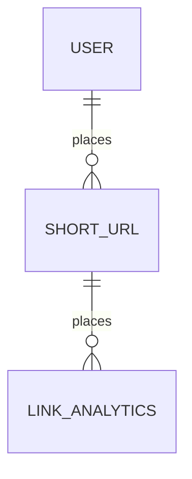

# gourl
A url shortener built with Golang + React

## Design Scope

1. __Maximum Lifetime Write Operations:__ _5 million_ (EC2 instance has to be shared with other projects and this application should not hog the limited memory space when using postgresql lookup index) 

2. __Allowed characters:__ `[0-9],[a-z],[A-Z]` 

3. __Logging Required:__
    - Redirect Failures 
    - System Errors
    - Basic Analytics
        - Total clicks for shorterned URL
        - Unique visitors
        - Platform clicked from (eg. Facebook, X, Reddit or unknown) 

4. __Security:__ 
    - Abuse prevention -> Rate limiter
    - Phishing reputation checks via external api
    - Account controls with no public sign up API to prevent bad actors from access
        - Protected endpoints 

## High level Design

### 301 vs 304 Redirect

_What is the difference?_

301 : Browser caches the actual url and subsequent requests will be sent out directly to the URL service

302 : Every request will be treated as new and subsequent requests will still hit the url shortening service.

This application will perform 302 requests to track metrics such as clicks, unique visitors and platoform clicked from

### Hashing or Encoding Algorithm

- Given the characters above we have a total of $10 + 26 + 26 = 62$ characters.
- To implement the unique value for the shorterned url, I will be using _Base 62 Encoding_.
    - With Base 62 encoding there is no need for expensive db operations to check for collisions as would be required if hashing was used. Base 62 encoding ensures that all values are unique. 

### DB Design and Implementation

__Schema:__

## Security

For this application, pay particular attention to security as it is not unreasonable to be targetted by scammers and bad actors. To address the security requirements, the application will have an account authorisation and authentication system. Authentication will be handled by OIDC (eg. Google Account, Facebook etc) and authorization will be handled by the application itself. Every account that is authorized has to first be approved by the application admin and url shorterner service and endpoints will be protected. 

As such there will be role based authentication and a seperate UI dashboard for admin to handle new accounts, existing accounts and to monitor other metrics via a dashboard.

Websites being shorterned will have to be vetted to ensure that they are not phishiing or scam related wesbites via _Google Safe Browsing API_. Period checks will be done on the 50 most recently accessed urls once every day via a batch service to ensure that sites remain compliant.

_Monitoring of Bad Actors_

In admin dashboard, if any accounts are seen to breach rate limiting rules or have used to url shorterner to mask malicious website then the admin will have the right and ability to blacklist and ban the account and the shorterned url will be blacklisted. An email service will be set up for admin to be notified if suspicious activities were to take place.

_Rate Limiting_

An in memory API rate limiter will be implemented to prevent bad actors from overwhelming the database with new urls. If a user is flagged for breaching API rate limits a HTTP 429 response will be issued with a temporary cooldown, if the user then continues violating the rate limits then the account will be flagged for review via email service and temporarily suspended automatically. Users are given benefit of doubt and some leeway in number of breaches before their account will be flagged for review. If user is confirmed to be a bad actor then they will be banned and blacklisted.   
