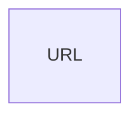

# gourl
A url shortener built with Golang + React

## Design Scope

1. __Maximum Lifetime Write Operations:__ _5 million_ (EC2 instance has to be shared with other projects and this application should not hog the limited memory space when using postgresql lookup index) 

2. __Allowed characters:__ `[0-9],[a-z],[A-Z]` 

3. __Logging Required:__
    - Creation Logs -> ip of creator for protection against bad actors
    - Redirect Failures 
    - System Errors
    - Basic Analytics
        - Total clicks for shorterned URL
        - Unique visitors
        - Platform clicked from (eg. Facebook, X, Reddit or unknown) 

4. __Security:__ 
    - URL validation -> Make sure its not a malicious site
    - Abuse prevention -> Rate limiter
    - Phishing reputation checks via external api

## High level Design

### 302 vs 304 Redirect

### Hashing or Encoding Algorithm

- Given the characters above we have a total of $10 + 26 + 26 = 62$ characters.
- To implement the unique value for the shorterned url, I will be using _Base 62 Encoding_.
    - With Base 62 encoding there is no need for expensive db operations to check for collisions as would be required if hashing was used. Base 62 encoding ensures that all values are unique. 

### DB Design and Implementation

__Schema:__

